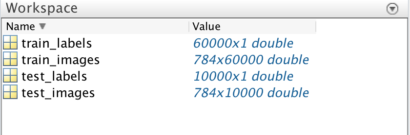

# DMT03 手写数字识别

15331310 吴博文

---

## 作业要求：

使用机器学习的方法识别手写数字，使用Mnist训练集训练并测试自己的模型

## 实验步骤

### 1、读取Mnist训练集

首先从http://yann.lecun.com/exdb/mnist 中下载Mnist训练集和测试集，然后了解其文件格式

> the IDX file format is a simple format for vectors and multidimensional matrices of various numerical types.
>
> The basic format is
>
> `magic number` 
> `size in dimension 0` 
> `size in dimension 1` 
> `size in dimension 2` 
> `.....` 
> `size in dimension N` 
> `data`
>
> The magic number is an integer (MSB first). The first 2 bytes are always 0.
>
> The third byte codes the type of the data: 
> 0x08: unsigned byte 
> 0x09: signed byte 
> 0x0B: short (2 bytes) 
> 0x0C: int (4 bytes) 
> 0x0D: float (4 bytes) 
> 0x0E: double (8 bytes)
>
> The 4-th byte codes the number of dimensions of the vector/matrix: 1 for vectors, 2 for matrices....
>
> The sizes in each dimension are 4-byte integers (MSB first, high endian, like in most non-Intel processors).
>
> The data is stored like in a C array, i.e. the index in the last dimension changes the fastest. 
>
> Happy hacking.

对于图片，尺寸是28 * 28，然后其实就是一个784维的向量，读的时候，首先获得矩阵维度的信息，之后一次性读入全部字节，放入一个数组，再根据读入的尺寸信息reshape数组，获得数据集，对于label集也是一样。

这里还有一点需要注意，貌似Mnist数据库中存储的数据行列顺序与matlab中不同，为了输入自己的图像时不造成歧义，需要处理一下这个问题，读完后，进行permute操作，将第一个维度和第二个维度互换。

```matlab
images = permute(images,[2 1 3]);
```

之后对于四个字节的int32型数据，其采用小端规则存储，最后一个参数指定了小端规则：

```matlab
numCols = fread(fp, 1, 'int32', 0, 'ieee-be');
```

读Mnist数据库的代码在网上有很多，这里我直接借鉴了http://blog.csdn.net/wangyuquanliuli/article/details/17378317中的代码。

读出后获得四个数组：



### 2、二值化

将读到的手写数字图片二值化：

```matlab
% binary
train_images(train_images > 2) = 1;
test_images(test_images > 2) = 1;
```

### 3、训练分类器

这里我使用的是随机森林，输入训练数据时注意数据的维度即可：

```matlab
model = TreeBagger(50, train_images', train_labels);
```

这里我发现如果我将树的个数调整为500，准确率反而会下降，所以还是有点玄学的。

### 4、预测训练数据

```matlab
result = model.predict(test_images');
```

### 5、统计准确率

```matlab
% calculate rate
[~, test_num] = size(test_images);
result_array = zeros(test_num, 1);

for i = 1 : test_num
temp = result(i);
result_array(i) = str2double(temp{1});
end

rate = sum(result_array == test_labels);
rate = rate / test_num;
```

首先需要将元组中的数据提取出来，从char类型转为double并放入数组中，统计与test_labels数组中元素相等的个数，除以总数即可。

### 6、最终结果

```
Accuracy : 0.966300. With Running Time : 56.398441
```

最终准确率为0.966300，耗费时间：56秒

对于这样简单的预处理和运算量不大的模型，这个准确率已经十分满足要求了