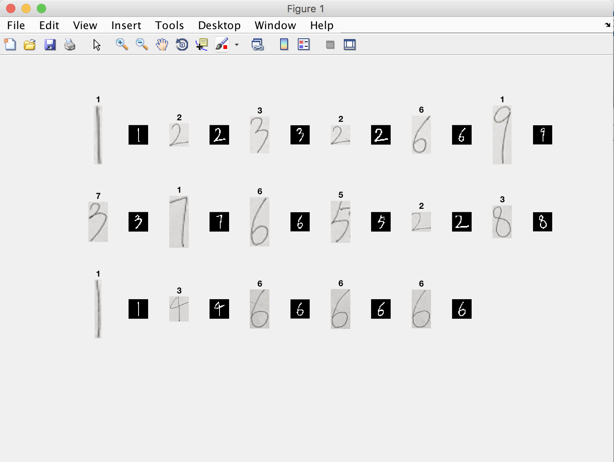

# 数字媒体技术作业4—识别纸上的手写数字

15331310 吴博文

---

## 1、内容

识别纸上的解决方案

## 2、解决方案

本次作业实际上是将前三次作业拼起来：

1. 首先提取出图片中A4纸，并校正
2. 提取出A4纸上的线条
3. 预处理第二步提取出的ROI
4. 输入之前训练好的模型，得到预测结果


## 3、解决的问题

本次作业主要是需要解决两个问题：

* 提取线条时，使得提取出的线条的顺序保持阅读顺序（从左到右，从上到下）
* 提取出ROI后的预处理（使其与Mnist的格式相近）

### ROI保持阅读顺序

其实这个问题就是一个给ROI排序的问题，我的解决方案是这样的，对于ROI的左上点进行一种特殊策略的排序。

因为对于同一行的数字，其纵坐标有高有低，所以我们在判断两个数字是否在同一行时不能采用相等的方式，而应该是两个纵坐标的差在一定范围内就可以判断他在同一行。

排序中comp函数如下：

```matlab
function [result] = comp(s1, s2)
            x1 = s1(1);
            y1 = s1(2);
            x2 = s2(1);
            y2 = s2(2);
            if abs(y1 - y2) < 30
                if x1 < x2
                    result = 1;
                else
                    result = 0;
                end
            elseif y1 < y2
                result = 1;
            else
                result = 0;
            end
        end
```

通过这个comp函数，可以正确的得到两个ROI间的先后顺序

### ROI的预处理

这部分其实非常重要，对于准确率的影响甚至大于模型的训练。我们需要使我们的图片尽可能的与Mnist训练集的图片相近，才能使我们的模型顺利的识别出来

首先我查阅了Mnist到底是怎么处理图片的：

> The original black and white (bilevel) images from NIST were size normalized to fit in a 20x20 pixel box while preserving their aspect ratio. The resulting images contain grey levels as a result of the anti-aliasing technique used by the normalization algorithm. the images were centered in a 28x28 image by computing the center of mass of the pixels, and translating the image so as to position this point at the center of the 28x28 field.

这段话总结来的意思是首先将图片（normalized）到一个20x20的像素块，这里其实我没有很读得懂，然后再将20x20的像素块放入28x28的像素块的中心区域，最终产生了784维的向量。

但是这个normalized我也不是很懂，这可能是导致我识别准确率一般的原因

> The digit images in the MNIST set were originally selected and experimented with by Chris Burges and Corinna Cortes using bounding-box normalization and centering. Yann LeCun's version which is provided on this page uses centering by center of mass within in a larger window.

这里可能还需要阅读很多东西才能完全实现，因为时间原因我只能实现部分。

#### 我的实现

1. 将ROI转成灰度图，二值化

   ```matlab
   % first step : make it 2-value
   input = rgb2gray(input);
   input = min_median_max_filter2d(input, 3, 3, @min, 255);
   input = im2bw(input, graythresh(input));
   input = ~input;
   ```

   这里需要注意的是最后要取反，这主要是因为前景背景0/1的表示问题

2. 将图片旋转正
   虽然我构思了这步，但是最终没有成功
   我的思路是，在-30度至30度之间旋转，在每个旋转角度下计算数字的宽度，最后选择宽度最小的一个角度，即为需要旋转的角度。
   然而我发现手写数字不全是细长的，有些时候使得宽度最小不代表数字就正过来了
   所以这一步我先跳过了，而且我看了一下Mnist里的数据有些也挺歪的，我们不能要求人写的数字一定要符合的要求

   ```matlab
   function [ output ] = rotateDigit( input )
   % input : 2-value digit image(logical)
   % output : 2-value digit image(logical) and rotate
   % make the width of digit minimum
       function [width] = widthOfROI(input)
           roi = bwlabel(input);
           [~, col] = find(roi == 1);
           width = max(col) - min(col);
       end
   % assumption : -30 ~ +30
   degreeAliasing = 31;
   width = zeros(61, 1);
   for i = 1 : 61
       width(i) = widthOfROI(imrotate(input, i - degreeAliasing));
   end
   [~, degree] = min(width);
   output = imrotate(input, degree - degreeAliasing);
   % imshow(output);
   end


   ```

3. 将图片补成正方形
   这步的目的是在下采样的时候不会使得数字的比例发生改变
   具体的做法如下：
   取原图片的长宽最大值作为目标正方形的尺寸，然后将源图填进去

   ```matlab
   [m, n] = size(input);
   outputSize = max([m, n]);
   output = zeros(outputSize, outputSize);
   if m >= n
       aliasing = round((outputSize - n) / 2);
       output(1:outputSize, 1 + aliasing + 1 : 1 + aliasing + n) = input(:, :);
   else
       aliasing = floor((outputSize - m) / 2);
       output(1 + aliasing : 1 + aliasing + m, 1 : outputSize) = input(:, :);
   end
   ```

4. 下采样为20x20

   ```matlab
   output_temp = imresize(output, [20 20]);
   ```

5. 放入28x28像素块中

   ```matlab
   output = zeros(28, 28);
   output(5:24, 5:24) = output_temp(:, :);
   ```

6. 向量化

   ```matlab
   output = reshape(output, 1, 28 * 28);
   ```


## 4、实验结果



17个数字 正确12个，经过多次实验，这已经是比较好的结果了

可以验证：数字的顺序与纸上相同

## 5、代码说明

训练、保存模型脚本：TrainAndTestModel.m

测试图片 : submission.m

需占用硬盘空间：2.27G