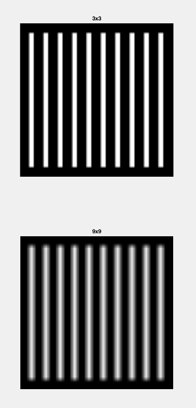
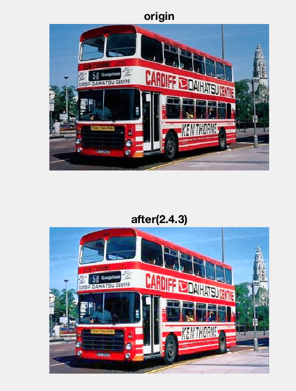

# HW4:图像复原和彩色图像处理

15331310 吴博文

[TOC]


## 1 习题

请回答以下问题，并将结果写入到你的报告中

### 1.1 彩色空间

#### 1

|      | 对应的图 | 原因                                       |
| ---- | ---- | ---------------------------------------- |
| R通道  | d    | 观察海绵宝宝红色领带部分，在d图中此部分很亮，说明是R通道            |
| G通道  | b    | 第一、黄色是绿色和红色的等量混合；第二、观察红色领带部分，比c图中该部分深很多；结合以上两点原因，判断出b图为G通道 |
| B通道  | a    | 观察海绵宝宝的蓝色眼球部分，在a图中此部分很亮，说明是B通道           |
| 灰度图  | c    | 根据RGB通道的判断，可知该图为灰度图                      |

为什么b图与c图相似？

因为此图大部分为黄色，对于黄色（一般来说）#FFFF00 ，G通道与R通道值相似，另外根据灰度图的计算公式，可知B通道对于亮度贡献比重比较小，综上，b图与c图会比较相近。

#### 2

ans：（b）

首先原图主体色彩是黄色，根据下图：


可知加上60度之后，黄色应该转换为绿色，所以应该为（b）（c）两张图之间的一张。

如果我们定义白色的Hue为$0^o$ ，其饱和度为0，根据HSI转RGB的相关公式，我们可以得知白色／黑色加上任意Hue之后还为白色／黑色，所以为（b） 


## 2 编程题

### 2.2 图像滤波

#### 1 算术均值滤波



* 对于算术均值滤波，其起到了模糊／平滑的作用

* 显然，较大的算术均值滤波器起到的模糊效果更强

* 长宽高：（该点灰度值不为0就认为其实白条的一部分）

  |      | 原图   | 3x3  | 9x9  |
  | ---- | ---- | ---- | ---- |
  | 宽    | 8    | 10   | 16   |
  | 高    | 224  | 226  | 232  |

  ​


#### 2 调和均值函数


根据调和均值滤波的滤波器形式，我们可知，如果在滤波器的范围内出现了值为0的像素点，那么得到的像素值就为0 。所以对于题目给出的图片，我们可以推知，更大尺寸的调和均值滤波器会使得白条变得更细。

长宽高：（该点灰度值不为0就认为其实白条的一部分）

|      | 原图   | 3x3  | 9x9  |
| ---- | ---- | ---- | ---- |
| 宽    | 8    | 6    | 0    |
| 高    | 224  | 222  | 0    |


#### 3 contra-harmonic mean filter


虽然反调和公式的形式与调和均值的公式差异比较大，但是当Q=-1.5时，其对于白条图片的效果与调和基本一样，更大的滤波器会使得白条变得更细。

长宽高：（该点灰度值不为0就认为其实白条的一部分）

|      | 原图   | 3x3  | 9x9  |
| ---- | ---- | ---- | ---- |
| 宽    | 8    | 6    | 0    |
| 高    | 224  | 222  | 0    |

### 2.3 图像去噪

#### 2.3.1 噪声生成器

#### 2.3.2 高斯噪声的去噪


参数说明：

各个滤波器的尺寸：

|      | 算术均值 | 几何均值 | 中值   |
| ---- | ---- | ---- | ---- |
| 尺寸   | 3x3  | 3x3  | 3x3  |

1. 算术均值滤波
   * 优点：在本题的三种滤波方式中，此种方式的滤波得到了较高的psnr，说明其取得了不错的降噪效果
   * 缺点：但是我们都知道算术均值滤波器其实也称为平滑滤波器，所以对于整张图片无论是否存在噪声，都进行了模糊操作，所以对于一些细节和边缘的影响会比较大，同时由于噪声的存在，图片的平整区域（即灰度相近的区域）整体亮度都发生了较大的改变。
2. 几何均值滤波
  * 优点：虽然psnr值并不是很高，但是从人眼的感官上来看，虽然明显的黑点比较多，但是大部分噪声都被消除了。同时对于边缘和细节的保留比较好
  * 缺点：psnr较低。产生一个一些黑点，由于几何均值过程中，滤波器范围内有0就会导致该点的运算结果为0。
3. 中值滤波
  * 优点：psnr较高。不会模糊边缘和细节。
  * 缺点：高斯噪声并不是一种肯定产生值特别大或者特别小的噪声，所以中值滤波并不能确保滤掉噪声，还可能让噪声通过，所以降噪效果很一般。

#### 2.3.3 盐噪声的去噪


为什么错误的Q值会导致糟糕的结果？

从公式中可以看出，当Q小于0时，盐噪声（灰度值最大）对于分母的和影响是最小的，所以此时可以滤掉盐噪声。但是当Q大于0时，无论是分子还是分母，越大的灰度值对于滤波器的计算结果影响就更大，此时噪声就不会被滤波器滤掉，反而会通过，所以会导致糟糕的结果。

对于椒噪声，当Q小于0时，会直接导致分母的求和出现正无穷，导致整体计算结果为0，所以此时椒噪声（灰度值为0）就通过了滤波器，导致了糟糕的结果。当Q大于0时，灰度值小的点对于整体的计算结果影响小，所以椒噪声此时会被滤掉。

#### 2.3.4 椒盐噪声的去噪


参数说明：

|      | 算术均值 | 几何均值 | 最大值滤波 | 最小值滤波 | 中值滤波 |
| ---- | ---- | ---- | ----- | ----- | ---- |
| 尺寸   | 5x5  | 3x3  | 3x3   | 3x3   | 5x5  |


1. 算术均值滤波
   看起来更好了。
   首先其psnr得到了提高，说明噪声被去掉了一部分。相比原来的有噪声的图片，我们可以看出原图的一些轮廓了。我们知道噪声的类型为等量的椒盐噪声，所以从概率的角度讲，对于一个滤波器的范围内，有很大的可能椒盐噪声的数量相同，椒盐噪声取平均得到一个中间的灰度值，再和真实的像素取平均，可以起到去噪的目的。
2. 几何均值滤波
   看起来更差了。
   从psnr看，非常低，所以更差了。另外从视觉上来看，比原先的噪声图片有更少的信息，所以也是更差了。
   原因是显然的，其乘积的计算方式注定只要3x3的范围内有一椒噪声就会得到0，加上椒噪声的成分很高，所以整张图就变黑了，也就变的更糟了。
3. 最大值滤波
   看起来更差了。
   从psnr看，非常低，所以更差了。另外从视觉上来看，比原先的噪声图片有更少的信息，所以也是更差了。
   由于本题的输入中存在盐噪声，这是灰度值中最大的一个像素，所以最大值滤波会使得盐噪声通过。因此最大值滤波不能用于椒盐噪声的去噪。
4. 最小值滤波
   看起来更差了。
   从psnr看，非常低，所以更差了。另外从视觉上来看，比原先的噪声图片有更少的信息，所以也是更差了。
   由于本题的输入中存在椒噪声，这是灰度值中最小的一个像素，所以最小值滤波会使得椒噪声通过。因此最小值滤波不能用于椒盐噪声的去噪。
5. 中值滤波
   看起来很好。
   从psnr看，提高了很多。从视觉上看，也好了很多。
   原因是显然的，盐噪声是最大值，椒噪声是最小值，所以通常来说无法通过中值滤波器，故噪声被滤掉了。

#### 2.3.5 描述各种滤波的实现方式

##### 2.3.5.1 算术均值滤波

直接调用之前的作业filter2d函数，输入的滤波器为$ones(3,3)$ 即可实现算术均值滤波器

ps. 也可以使用Q=0的反调和均值滤波器实现

##### 2.3.5.2 几何均值滤波器

基本流程与算术均值滤波器相同，但是算术均值的求和过程改成求积过程，对于边缘的情况，进行与filter2d中相同的padding。这次我将函数头设计为以下：

```matlab
function [ output_img ] = geometric_mean_filter2d( img, filterSize_h, filterSize_w, paddingElement, whetherDraw )

```

paddingElement指的就是在padding时填充的元素的值，在循环过程中如果检测到越界就使用这个值替代图片中的值。具体过程：

```matlab
if ((i + m) < 1 || (i + m) > h)
	% over border 1
	% padding
	element = paddingElement;
elseif ((j + n) < 1 || (j + n) > w)
	element = paddingElement;
else
	element = img(i + m, j + n);
end
```

这里我采用的值是0，所以几何均值滤波会产生一条黑边。

##### 2.3.5.3 调和均值滤波

使用Q=-1的反调和均值滤波器实现

##### 2.3.5.4 反调和均值滤波

与算术均值滤波差不多，只是在求和的过程中需要乘方上相应的Q值。

##### 2.3.5.5 最大值、最小值与中值滤波

使用一个矩阵将指定大小范围内的值保存起来，然后对其取最大值、最小值或者中值。

这里值得说明的就是，我发现了matlab的句柄，这个东西类似于C语言中的函数指针，这样就可以将以上三种滤波写在同一个函数中了，只需要传入min、max或者median句柄即可。如下所示：

```matlab
function [ output_img ] = min_median_max_filter2d(img, filterSize_h, filterSize_w, handle, paddingElement, whetherDraw)

```

期中handle即为句柄，这样使用：

```matlab
output_img(i, j) = handle(temp_matrix(:));
```

这个函数的调用方式为：

```matlab
min_img = min_median_max_filter2d(noise_img, 3, 3, @min);
```

加上@符号即成为一个句柄

### 2.4 彩色图像直方图均衡化

#### 2.4.1 RGB通道的直方图均衡化


#### 2.4.2 利用平均直方图分别对三个通道进行均衡化


#### 2.4.3 HSI模型下的直方图均衡化



####2.4.4 比较以上三个不同的结果

* 第一张图，相比其他两张图，色调和饱和度发生了很明显的改变。这主要是因为RGB三个通道分开进行均衡化，其互相不干扰，所以原图的色调和饱和度都会发生不可预知的改变。
* 第二张图整体的色调没有大的改变，但是整体暗淡了很多，颜色饱和度下降。
  这张图是对于三个通道的直方图平均后得到的直方图做均衡化，对三个通道再分别应用这个均衡化过程的转换函数得到均衡化的结果。在这个过程中，由于对于三个通道应用相同的映射关系，同时我们观察到整张图片红色、蓝色、绿色的元素非常多，对于这些像素点都是单个通道的值很高而剩下两个通道的值比较低。下图是我画出的转换函数（对于以上图片）：
  
  可以看出，较小的值会被提高到较大的值，而较大的值改变则不明显，所以对于原先图片中大量出现的红色、绿色和蓝色，剩下两个通道的值会被提高，结果就是颜色的饱和度下降了，即被引入更多的白光，这也就是颜色暗淡的原因。
* 第三张图我们是将图片先转为HSI模型，然后对Intensity通道进行直方图均衡化。我们知道Intensity通道的值对于视觉最直观的感受就是整张图的亮度或者说是颜色的明亮程度。我们可以明显的看出原图的光线并不是很好，整体颜色偏暗。通过均衡化Intensity后，整张图片的颜色明亮了很多，或者从视觉上来说，光线好了很多。